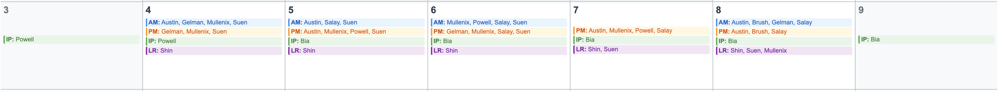

# Chinle Primary Care Scheduler 

The scheduler is a custom-built Python tool to help automate and streamline the creation of outpatient clinic schedules for Internal Medicine, Family Practice, and Pediatrics. 

The goal is to make the scheduling process more transparent, consistent, and timely. Ideally, this tool will allow the entire outpatient schedule to be generated shortly after the inpatient schedule and leave requests are finalized.

## Problem Overview

Consider a 5-day week with 9 total clinic sessions. If 5 providers are available per day on average and each clinic session can staff 3 providers, an upper bound on the number of schedule combinations is:

$${\binom{5}{3}}^9 = 10^9 = 1,000,000,000$$

Even after applying just a single constraint, limiting each provider to a maximum of 6 sessions per week, a conservative estimate suggests that 10–20% of these combinations remain feasible, resulting in roughly 100–200 million valid schedules. When scaled across multiple departments and multiple months, the size of the scheduling space becomes astronomically large.

The real complexity, however, doesn’t lie in the sheer number of possible schedules, but in how tightly interwoven constraints like leave, staffing minimums and maximums, and per-provider clinic caps interact to restrict the feasible set.

To solve this efficiently, the scheduler uses [CP-SAT](https://developers.google.com/optimization/cp), an open-source solver developed by Google that’s designed for constraint satisfaction problems. CP-SAT is particularly well-suited to scheduling problems like ours because it can efficiently handle both hard constraints and soft preferences. 

## How the Scheduler Works 

The scheduling software converts the primary care department clinic rules into computer logic through a three-layer structure: 

1. **Plain-English Documentation** - Core scheduling policies established by Chinle administration are documented in `docs/clinic_rules.pdf` and `docs/call_rules.pdf`.
2. **Configuration Files** - These policies are codified in human-readable YAML files (`config/` folder) containing both clinic-level rules (staffing minimums, holiday dates) and provider-specific rules (workload limits, RDO preferences). This structure makes it easy to adjust existing constraints without programming knowledge, add new providers or modify existing provider parameters, and maintain separate rule sets for each department.
3. **Mathematical Constraints** - The YAML rules are translated into mathematical constraints for the CP-SAT model in the `constraints/` folder.
    
    The mathematical constraints are implemented as a combination of:
    * **Hard constraints** that cannot be violated (e.g., providers cannot work clinic during inpatient).
    * **Soft constraints** with penalties that guide the optimizer toward preferable solutions while maintaining flexibility when strict adherence isn't possible (e.g., ensuring that providers work as close as possible to their designated weekly clinic amount).

The scheduling software uses CP-SAT for solving the scheduling puzzle. CP-SAT is able to try thousands of scheduling combinations in seconds and find the best solution among all the valid possibilities. All constraints are considered simultaneously by CP-SAT during solving. This approach ensures the scheduler can find workable solutions even when competing requirements make perfect solutions impossible.

## Scheduler Inputs 

The scheduler relies on three main inputs:

1. **Date Range** – the date range over which the schedule will be built (see `utils/calendar.py`).
2. **Leave Requests** – requested time off for department providers (see `data/leave_requests.csv`).
3. **Inpatient Assignments** – scheduled inpatient rotations for department providers (see `data/inpatient.csv`).

## Schedule Generation

Each department generates its own schedule. The schedule for each department is created through these key steps:

1. **Input Processing**: The scheduler takes in the inputs as defined above.
2. **Model Building**: It creates decision variables and translates all scheduling rules into mathematical constraints.
3. **Iterative Solving**: The CP-SAT solver finds the highest feasible minimum staffing level by starting with 4 providers per session (user configurable) and iteratively reducing this requirement until a feasible schedule is achieved.

The system treats all submitted leave requests as pre-approved during the scheduling process and automatically identifies the highest achievable minimum staffing level given the leave requests. This provides a clear picture of the "worst-case" staffing scenario if all requested leave were granted. Final leave approval remains at the discretion of department chiefs.

### Cross-Department Scheduling 

Some primary care providers at Chinle serve in multiple departments, for example, working clinic in Family Practice while also taking call or clinic shifts in Pediatrics. To manage this complexity, the scheduler is run sequentially by department in a way that accounts for interdependencies:

* **Pediatrics First**: The Pediatrics schedule is generated first. This determines call and clinic assignments for all providers involved in Pediatric coverage, including those who also work in other departments.
* **Internal Medicine and Family Practice Next**: Once the Pediatrics schedule is finalized, it is used to block off corresponding dates for cross-department providers. These constraints are then incorporated into the Internal Medicine and Family Practice scheduling runs to ensure providers aren’t double-booked or overcommitted.

This staged approach ensures that cross-department providers are scheduled consistently and without conflict across the three services. It also reflects the higher coordination demands of Pediatrics, where call coverage is tightly structured and less flexible than general clinic staffing.

### Specialty Clinics 

The scheduler enforces constraints for fracture clinic, ensuring that at least one fracture clinic provider is scheduled for both morning and afternoon sessions on Wednesdays. Additional specialty clinic rules could be incorporated in future versions as needed.

## Scheduler Output

The scheduler produces a binary output for each provider, day, and session:

- 1 = scheduled to work in clinic or call
- 0 = not scheduled (ie., admin, RDO, inpatient, or leave) 

This binary decision matrix is then translated into user-friendly outputs which provide detailed information about the quality of the scheduling solution.

### Schedule Dataframe

The primary output is the complete schedule showing which providers are assigned to each session:

|      date     | day_of_week |  session  |      providers      | count |
|---------------|-------------|-----------|---------------------|-------|
| 2025-08-04    | Monday      | morning   | House,Spaceman      |   2   |
| 2025-08-04    | Monday      | afternoon | Evil,House          |   2   |

### Provider Summary Dataframe

A summary of each provider's clinic workload is also generated:

|  provider  | week_32 | week_33 | week_34 | week_35 | total_sessions | monday_or_friday_off | total_AM | total_PM |
|------------|---------|---------|---------|---------|----------------|----------------------|----------|----------|
| Evil       |   5,3   |   0,0   |   3,2   |   6,4   |       14       |          3           |    7     |    7     |
| House      |   4,2   |   4,3   |   6,6   |   0,0   |       14       |          3           |    7     |    7     |
| Spaceman   |   3,2   |   6,6   |   6,3   |   6,6   |       21       |          2           |    10    |    11    |

**Column Explanations:**
- **Week columns (e.g., week_32)**: Show total sessions and maximum consecutive sessions for that week in format "total, consecutive"
- **total_sessions**: Total clinic sessions across all weeks
- **monday_or_friday_off**: Total weeks with either Monday or Friday off
- **total_AM**: Total morning clinic sessions
- **total_PM**: Total afternoon clinic sessions

### Call Summary Dataframe

For pediatrics, each provider's call workload is also generated: 

|  provider  | week_32 | week_33 | week_34 | week_35 | total_call | 
|------------|---------|---------|---------|---------|------------|
| Evil       |    2    |    2    |    1    |    0    |     5      |   
| House      |    2    |    0    |    1    |    0    |     3      |    
| Spaceman   |    0    |    1    |    1    |    1    |     3      |   

### HTML Calendar

The schedule dataframe can be converted to an HTML calendar for easy viewing using a separate function (see `utils/calendar_formatter.py`).

**Example Calendar Week:**



*One week view of the generated HTML calendar for Family Practice showing morning and afternoon clinic assignments, plus inpatient assignments (IP) and leave requests (LR) for Family Practice providers.*

### Solution Status 

Detailed information about the scheduling process and solution quality:

```python
{'Status': 'OPTIMAL',
 'Minimum providers per session': 2,
 'Objective value': 4100.0,
 'Solve time': 0.022486 seconds,
 'Branches': 640,
 'Conflicts': 0}
 ```

When the scheduler completes, it provides either an OPTIMAL solution (proven best possible) or FEASIBLE solution (valid but not proven optimal within the 5-minute time limit). Both are suitable for implementation.

The objective value represents the total penalty from soft constraint violations. A lower value indicates a better schedule. Common penalties include:
* Providers not meeting target clinic sessions
* A provider on pediatric call multiple times in a week 
* RDO assigned the day after call

## Quality Assurance 

All schedules generated by the scheduler serve as first drafts. Alberta Begay then processes these schedules to incorporate administrative time blocks and finalize RDO assignments before department chiefs conduct their final review and implementation.

## Usage

```python
from engine.engine import create_im_schedule
from datetime import date

# Generate Internal Medicine schedule
schedule_df, provider_summary_df, solution_status = create_im_schedule(
    config_path = '../config/internal_medicine.yml',
    leave_requests_path = '../data/leave_requests.csv',
    inpatient_path = '../data/inpatient.csv',
    start_date = date(2025, 8, 4),
    end_date = date(2025, 8, 29)
)
```

A full walkthrough of how the Internal Medicine, Family Practice, and Pediatric schedules were created for August 2025 can be found in `notebooks/august_schedule.ipynb`.

## Directory Architecture

```bash
├── config/                             # Clinic and provider rules 
│   ├── family_practice.yml
│   ├── internal_medicine.yml
│   └── pediatrics.yml
├── constraints/                        # Scheduling rules and constraint logic
│   ├── family_practice.py
│   ├── internal_medicine.py
│   └── pediatrics.py
├── data/                               # Input data
│   ├── inpatient.csv
│   └── leave_requests.csv
├── docs/                               # Plain-English summary of scheduling rules and calendar output example
│   ├── images/                            
│   │   └── example_calendar.png
│   ├── clinic_rules.pdf
│   └── call_rules.pdf     
├── engine/                             # Entry point for running the scheduler
│   └── engine.py
├── notebooks/                          # Jupyter notebooks for running the scheduler 
│   └── august_schedule.ipynb
├── output/                             # Schedule output by month and department saved as CSV and HTML files
│   ├── month_1/
│   │   ├── family_practice/
│   │   ├── internal_medicine/
│   │   └── pediatrics/
│   ├── month_2/
│   ├── month_3/
│   └── month_4/
│       └──[each department folder contains:]
│          ├── calendar.html
│          ├── provider_summary_df.csv
│          ├── schedule_df.csv
           └── call_summary_df.csv      # (Pediatrics only)
└── utils/                              # Input parsing and calendar creation
    ├── calendar.py
    ├── calendar_formatter.py
    └── parser.py
```

## Requirements

Built and tested in python 3.13.

Core dependencies: 
- pandas
- numpy
- pyyaml
- ortools
